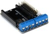
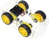
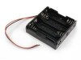

# ESP-Shield-Controlled-Robot

## Bill of Materials (BOM)

* NodeMCU (ESP8266) 
* ESP motor shield 
* Robot structure with at least one DC motor on each side 
* Batteries and battery holder to power the shield 

## Installation (linux)

* clone this repository, in linux command line, run: `clone https://github.com/oangelo/ESP-Shield-Controlled-Robot.git`, used to create a copy of an existing Git repository in a new local directory.
* [Install the ESP8266 board on Arduino IDE](https://github.com/esp8266/Arduino)
* Use [ESP8266fs](https://github.com/esp8266/arduino-esp8266fs-plugin) to upload the HTML file located inside the "robot/data" folder to the ESP. Please refer to the manual of ESP8266fs for instructions.

## Usage

* Disable "Mobile Data" connection to the internet
* Connect to the "robot" Wi-Fi network
* Open the URL http://192.168.4.1 on a browser
* Use the buttons on the web page to control the robot

## CMD 

* Build and upload the sketch using the following command: `arduino --upload robot.ino --port /dev/ttyUSB*`
