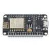

# ESP-Shield-Controlled-Robot

This project is designed for a simple robot, which utilizes the ESP motor shield to control multiple motors. While researching existing codes online, I found that many were dependent on the internet, external WiFi and an Android app. However, in this project, the ESP generates its own WiFi network that users can connect to, and provides a website for users to control the robot. The best part is that no external devices are needed!

## Bill of Materials (BOM)

* NodeMCU (ESP8266) 

    

* ESP motor shield 

    

* Robot structure with at least one DC motor on each side 

    

* Batteries and battery holder to power the shield 

    

## Installation (linux)

* clone this repository, in linux console, run: `clone https://github.com/oangelo/ESP-Shield-Controlled-Robot.git`, used to create a copy of an existing Git repository in a new local directory.
* [Install the ESP8266 board on Arduino IDE](https://github.com/esp8266/Arduino)
* Use [ESP8266fs](https://github.com/esp8266/arduino-esp8266fs-plugin) to upload the HTML file located inside the "robot/data" folder to the ESP. Please refer to the manual of ESP8266fs for instructions.

## Usage

* Disable "Mobile Data" connection to the internet
* Connect to the "robot" Wi-Fi network
* Open the URL http://192.168.4.1 on a browser
* Use the buttons on the web page to control the robot

## Console 

* Build and upload the sketch using the following command: `arduino --upload robot.ino --port /dev/ttyUSB*`

## References

* [Make Wi-Fi Controller Car Using Esp8266](https://www.hackster.io/diyprojectslab/make-wi-fi-controller-car-using-esp8266-297e49)
* [Simplest Wifi Car Using ESP8266 Motorshield](https://www.instructables.com/Simplest-Wifi-Car-Using-ESP8266-Motorshield/)
